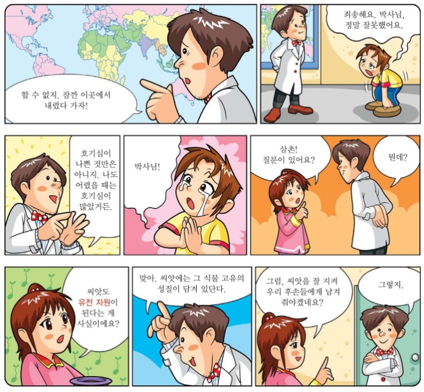

# 나라동식물유전자원(NaraGeneticSeed)☎02-400-1803☎
<h2>쇼핑,유통 > 농업용품, 농업, 양액비료, 온실공사, 종자도소매, 비료도소매</h2>
<h4>(Shopping, Distribution > Agricultural Products, Agriculture, sheep fertilizer, greenhouse construction, seed retail, fertilizer wholesale and retail)</h4>
<html>

<head>
 
</head>

<body>
<body background="유전자원사이트배경.png"> 
<audio src="배경음악.mp3" controls autoplay></audio>
<a class="btn blue" href="https://map.naver.com/local/siteview.nhn?code=1073764091&_ts=1562172539464" target="_blank">안녕하세요. '나라동식물유전자원'입니다. 반갑습니다^^. 저희 '나라동식물유전자원' 기업은 서울 송파구에 위치한 중소기업으로 농업용품, 씨앗종자, 양액비료 등을 유통시키고 온실공사, 종자도소매, 비료도소매업을 도맡아하고 있습니다.밑에는 저희 나라유전자원에서 싼 단가로 지역 농가에 보급한 씨앗으로 기른 '파프리카'를 각각 농가에서 찍은 영상물을 나라유전자원에서 편집한것입니다.사이트배경음악을 끄고 틀어주세요</a>

<iframe width="500" height="300" src="https://www.youtube.com/embed/WgQIPLgDT2M" frameborder="0" allow="accelerometer; autoplay; encrypted-media; gyroscope; picture-in-picture" allowfullscreen></iframe>

<h3>*여기서 잠깐! '유전자원(genetic resource)'이란?▶생물이 가지고 있는 유전 정보(genetic information held by living things) 
<h4>유전 자원은 생물이 가지고 있는 유전 정보&유전은 부모의 특징이 자손에게 전해지는 것 
씨앗은 매우 중요한 유전 자원 중 하나이므로 유전 자원 확보를 위해서 종자 은행 설립 
종자 은행?→ 여러 종류의 식물 종자를 수집하여 품종을 영구적으로 보존하여 생물 다양성 유지, 농작물 개량, 신약 개발 등의 생명 공학 소재 제공 
유전 자원과 관계있는 협약으로 생물 다양성 협약(CBD)이 존재→생물 다양성 보존과 유전 자원을 이용하면서 발생하는 이익의 공정하고 공평한 배분을 위한 협약 

  

<b>아래는 국가관리 농업유전자원에 대한 정보를 종합적으로 제공하는  농업유전자원 서비스시스템 주소입니다(참고)</b>

<b>Below is the website of the Agricultural Genetic Resources Service System</b>

하단의 빨간 버튼을 클릭하세요(click red button below)

  <a class="btn red" href="http://genebank.rda.go.kr/" target="_blank">농업유전자원 서비스시스템 홈페이지 (Agricultural Genetic Resources Service System website)</a>

  

<b>아래는 유럽의 생물 다양성 정보 시스템 주소입니다(참고)</b>

<b>Below is the website of biodiversity information system for europe</b>

하단의 빨간 버튼을 클릭하세요(click red button below)

  <a class="btn red" href="https://biodiversity.europa.eu/topics/genetic-resources" target="_blank">유럽의 생물 다양성 정보 시스템 홈페이지 (Biodiversity information system for europe website)</a>

